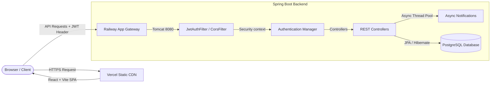

# EduFlow - Advanced Education Workflow Automation

[](https://react.dev/)
[](https://spring.io/projects/spring-boot)
[](https://spring.io/projects/spring-security)
[](https://www.postgresql.org/)
[](https://vercel.com/)
[](https://railway.app/)

EduFlow is a production-ready, full-stack workflow automation system designed for educational institutions. It automates administrative tasks, student enrollment records, course scheduling, and triggers asynchronous communication.

---

## 🚀 Live Demo & Recruiter Access

* **Live Frontend Website**: [https://frontend-kohl-sigma-24.vercel.app](https://frontend-kohl-sigma-24.vercel.app)
* **Live Backend API**: [https://eduflow-production-7901.up.railway.app](https://eduflow-production-7901.up.railway.app)
* **API Documentation**: [Swagger OpenAPI UI](https://eduflow-production-7901.up.railway.app/swagger-ui/index.html)

### Recruiter Credentials
The database has been seeded automatically with mock demo data. You can log in directly using any of these roles:

| Role | Username | Password | Access Privileges |
|------|----------|----------|-------------------|
| **ADMIN** | `admin` | `admin123` | Full access, delete students/courses, register users |
| **FACULTY** | `faculty` | `faculty123` | Access student lists, enroll/unenroll, dispatch notifications |
| **STAFF** | `staff` | `staff123` | View-only metrics, CRUD students, view course lists |

---

## 🏛️ System Architecture

The application is structured as a modern decoupled Web App:



### Key Technical Challenges Solved:
1. **Actuator DOWN state debug**: Solved an SMTP outbound socket connection timeout issue by disabling the blocking MailHealthIndicator, bringing the service status from 503 DOWN to healthy 200 UP.
2. **CORS Handling**: Configured a dynamic CORS filter using `setAllowedOriginPatterns` to securely allow dynamic origins from Vercel deployments while allowing authentication credentials (cookies/tokens).
3. **Single Page Routing**: Designed rewrite rules in `vercel.json` to route clean URL paths back to `index.html` preventing 404 errors on hard refreshes.

---

## ⚙️ Tech Stack & Key Libraries

### Backend
* **Spring Boot 3.x** - Web REST APIs
* **Spring Security & JWT** - Statless session authentication and Role-Based Access Control (RBAC)
* **Spring Data JPA & Hibernate** - ORM mappings and schema migrations
* **PostgreSQL** - Production-grade relational database
* **Spring Actuator** - Application health monitoring

### Frontend
* **React 19 & Vite** - Fast, bundled single page app architecture
* **Material UI (MUI) v6** - Premium typography (Outfit + Inter), glassmorphism design system, and custom dark mode toggles
* **React Hook Form** - Efficient, validated client-side forms
* **Recharts** - Dynamic student demographic visualization

---

## 📋 Features

* **JWT Stateless Auth**: Secure token-based session validation. Auto-attaches `Bearer` tokens to all requests via Axios interceptors.
* **Role-Based Access Control**: Route protections dynamically toggle visibility of navigation links and restrict backend endpoints based on roles (ADMIN, FACULTY, STAFF).
* **Student Lifecycle Management**: Complete CRUD operations, tracking active, inactive, and graduated students.
* **Course Enrollment Matrix**: Many-to-many database mapping allowing real-time enrollments and unenrollments of students in courses.
* **Asynchronous Dispatches**: Event-driven notification logger using Spring Async thread pool.

---

## 🛠️ Local Development Setup

### Prerequisites
* Java 17+
* Node.js 18+
* PostgreSQL

### 1. Backend Setup
```bash
cd eduflow
# Set environment variables
export DB_URL=jdbc:postgresql://localhost:5432/eduflow
export DB_USERNAME=postgres
export DB_PASSWORD=your_password
export JWT_SECRET=your_super_secret_signing_key_here

# Build and Run
mvn spring-boot:run
```

### 2. Frontend Setup
```bash
cd eduflow/frontend
npm install

# Configure local env
echo "VITE_API_BASE_URL=http://localhost:8080" > .env

# Run development server
npm run dev
```

---

## 📄 License
Licensed under the [MIT License](LICENSE).
